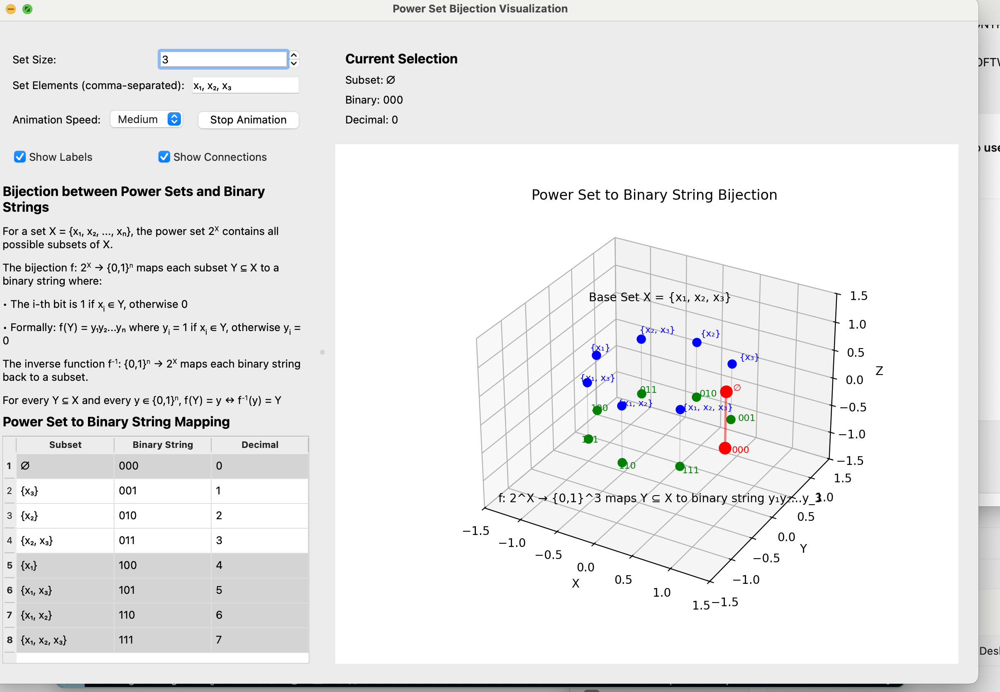

#Created by Justin Guida May 31 2025
# BitsetSphere
*This is the barebones version of the product. Have a full suite of scienetifc apps in the works.* 
*Feel free to use this as an education tool or for your own personal use but this is not for commeercial use and you must give credit to the original author.*

**BitsetSphere** is an interactive 3D visualization tool that maps the **bijection between power sets and binary strings** onto a sphere. It's designed to aid mathematical intuition and provide pedagogical clarity for students, educators, and researchers exploring combinatorics, set theory, and logic.

---

## Overview

BitsetSphere visualizes the function:

f: 2^X → {0,1}^n

Each subset `Y ⊆ X` is mapped to a binary string `y = y₁y₂...yₙ`, where:

- `yᵢ = 1` if `xᵢ ∈ Y`
- `yᵢ = 0` if `xᵢ ∉ Y`

This binary string is then mapped to a point on a sphere, offering a spatial representation of set membership and binary encoding.

---

##  Features

-  Real-time animation to explore subset space
-  3D spherical mapping of subsets and encodings
-  Label display for binary and decimal representation
- Interactive table selection with synchronized highlighting
-  Clean PySide6 GUI with Matplotlib integration

---

##  Use Cases

- Visual demos in combinatorics and discrete math courses
- Teaching bijective mappings and encoding logic
- Exploring binary strings and set relationships interactively

---

## Installation

### Install from requirements.txt
```bash
# Clone the repository
git clone https://github.com/jguida941/BitsetSphere.git
cd BitsetSphere

# Install all dependencies
pip install -r requirements.txt
```

### Alternative: Manual Installation
```bash
pip install numpy matplotlib PySide6
```

**Note**: The project includes a `requirements.txt` file with all necessary dependencies and version specifications.

---

##  Running the Application

```bash
python bijection_mapping.py
```

---

##  Project Structure

```
BitsetSphere/
├── bijection_mapping.py     # Main GUI and visualization logic
├── requirements.txt         # Python dependencies
├── README.md               # This file
└── LICENSE                 # License file
```

### Key Components
- **bijection_mapping.py** — Main GUI and visualization logic
- **VisualizationWorker** — Threaded worker to compute 3D points
- **FigureCanvas** — Embedded 3D Matplotlib canvas

---

## 🧬 How It Works

Each subset of a user-defined set is encoded into a binary string. These strings are geometrically projected onto a sphere. Users can:

-   Select entries in the subset table to highlight corresponding points
-   Run animations to step through the entire subset space
-   Toggle labels and connections to adjust clarity vs. performance
-   Customize set elements and size (1-6 elements)
-   Click 3D points to select corresponding table entries

### Interactive Features

| Action | Result |
|--------|--------|
| Click table row | Highlights 3D points in red |
| Click 3D point | Selects corresponding table row |
| Start Animation | Cycles through all 2^n combinations |
| Toggle Labels | Shows/hides subset and binary labels |
| Toggle Connections | Shows/hides bijection lines |

---

## Future Work

-  Exporting graphs and data to CSV
-  Hamming distance-based layout mode
-  GPU-accelerated rendering for larger power sets
-  Built-in tutorial system
-  Web-based version for broader accessibility
-  Mobile-friendly interface

---

## 🎓 Educational Applications

### For Students
- **Visual Learning**: See abstract mathematical concepts in 3D
- **Interactive Discovery**: Click and explore to build intuition
- **Progressive Complexity**: Start with small sets, scale up

### For Educators
- **Classroom Demos**: Large-screen friendly visualizations
- **Concept Reinforcement**: Multiple synchronized views
- **Hands-on Learning**: Direct student interaction

---

## 🔧 Technical Requirements

### System Requirements
- **Python**: 3.8 or higher
- **Operating System**: Windows 10+, macOS 10.15+, Linux (Ubuntu 20.04+)
- **Memory**: 4GB RAM minimum (8GB recommended for larger sets)
- **Graphics**: OpenGL-compatible graphics card

### Dependencies
| Package | Version | Purpose |
|---------|---------|---------|
| PySide6 | 6.0+ | GUI framework |
| matplotlib | 3.5+ | 3D visualization |
| numpy | 1.20+ | Numerical computations |

---

##  Quick Start Guide

1. **Install**: Run `pip install -r requirements.txt`
2. **Launch**: Execute `python bijection_mapping.py`
3. **Explore**: Click table entries or 3D points
4. **Animate**: Press "Start Animation" to see the bijection in action
5. **Customize**: Change set elements to your own values

---

##  Screenshots


*Caption: Complete application showing table, 3D visualization, and controls*

---

##  Contributing

Contributions are welcome! Here's how you can help:

1. **Fork** the repository
2. **Create** a feature branch (`git checkout -b feature/AmazingFeature`)
3. **Commit** your changes (`git commit -m 'Add some AmazingFeature'`)
4. **Push** to the branch (`git push origin feature/AmazingFeature`)
5. **Open** a Pull Request

### Areas for Contribution
-  UI/UX improvements
-  Performance optimizations
-  Educational content
-  Bug fixes
-  Documentation

--- 

#  License & Credits
## Creative Commons Attribution-NonCommercial 4.0 International License (CC BY-NC 4.0)

**Copyright (c) 2025 Justin Guida**

This work is licensed under the **Creative Commons Attribution-NonCommercial 4.0 International License**.

You are free to:

**Share** — copy and redistribute the material in any medium or format  
**Adapt** — remix, transform, and build upon the material  

Under the following terms:

 **Attribution** — You must give appropriate credit, provide a link to the license, and indicate if changes were made. Credit must include:
- Name: *Justin Guida*
- Year: *2025*
- GitHub: [https://github.com/jguida941](https://github.com/jguida941)

 **NonCommercial** — You may not use the material for **commercial purposes** without **explicit written permission** from the author.

Additional terms:

- **You may not sell**, rebrand, or redistribute this work for profit.  
- Educational institutions and students may freely use, adapt, and build upon this work **for non-commercial academic use**, including course materials and presentations.
- Derivative works must also credit the original author clearly.

---

To view the full license, visit:  
[https://creativecommons.org/licenses/by-nc/4.0](https://creativecommons.org/licenses/by-nc/4.0)

### Credits
BitsetSphere is free for academic use and personal development. Attribution is appreciated in educational settings.

**Created and maintained by Justin Guida – 2025**

### Acknowledgments
- **Mathematical Foundation**: Based on fundamental concepts in discrete mathematics
- **Visualization**: Powered by matplotlib and PySide6
- **Educational Philosophy**: Inspired by visual mathematics communication

---

##  Support & Contact

-  **GitHub Issues**: [Report bugs or request features](https://github.com/justinguida941/BitsetSphere/issues)
-  **Email**: justinguidascell@gmail.com
- 💬**Discussions**: Use GitHub Discussions for questions and ideas

---
